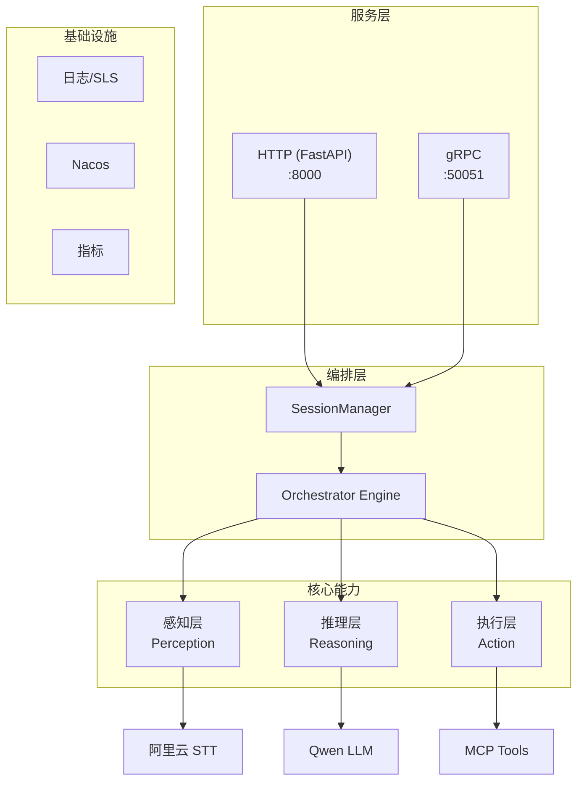

# Omni-Agent

## 简介

Omni-Agent 是一个通用智能体内核，基于 Qwen-Agent 开发，为 DeepKnow 微服务体系提供 AI 能力层。它作为业务服务（如 GoodTalk）的 AI 后端，通过 gRPC 和 HTTP 双协议对外提供 STT、LLM、Agent 等能力。

## 技术栈

| 类别 | 技术 |
|-----|-----|
| 语言 | Python 3.11 |
| AI 框架 | Qwen-Agent |
| Web | FastAPI + Uvicorn |
| RPC | gRPC |
| 配置中心 | Nacos |
| 日志 | 阿里云 SLS |
| 语音 | DashScope Paraformer |
| LLM | DashScope Qwen |
| 工具协议 | MCP |
| 部署 | Docker + ACR + ECS |

## 术语表

| 术语 | 含义 |
|-----|-----|
| Session | 会话，Task 的容器，用于多轮对话 |
| Task | 任务，Agent 执行的原子单位 |
| Orchestrator | 编排引擎，协调感知→推理→执行流程 |
| PerceptionEvent | 感知事件，多模态输入的统一输出格式 |
| MCP | Model Context Protocol，工具调用协议 |

## 架构图



## 目录结构

```
src/
├── main.py              # FastAPI 入口，生命周期管理
├── orchestrator/        # 编排层：Session、Task、Engine
├── perception/          # 感知层：STT 等多模态输入
├── reasoning/           # 推理层：LLM 服务、OmniAgent
├── action/              # 执行层：工具管理、MCP 客户端
├── server/              # 服务层
│   ├── http/            # REST API 路由
│   └── grpc/            # gRPC 服务实现
├── infra/               # 基础设施：日志、Nacos、指标
└── ui/                  # Gradio UI（开发用）

proto/                   # gRPC 接口定义
config/                  # 配置文件
deploy/                  # 部署配置
```

## 约束

### 必须遵守
- 所有对外接口必须同时支持 gRPC 和 HTTP
- 日志必须使用结构化格式，包含 trace_id
- 配置优先从 Nacos 读取，环境变量作为 fallback
- API Key 等敏感信息不得硬编码

### 不做什么
- 不直接依赖具体 LLM 实现，通过 Registry 抽象
- 不在 Task 中持有 Session 引用（保持单向依赖）
- 不在感知层做业务逻辑判断
