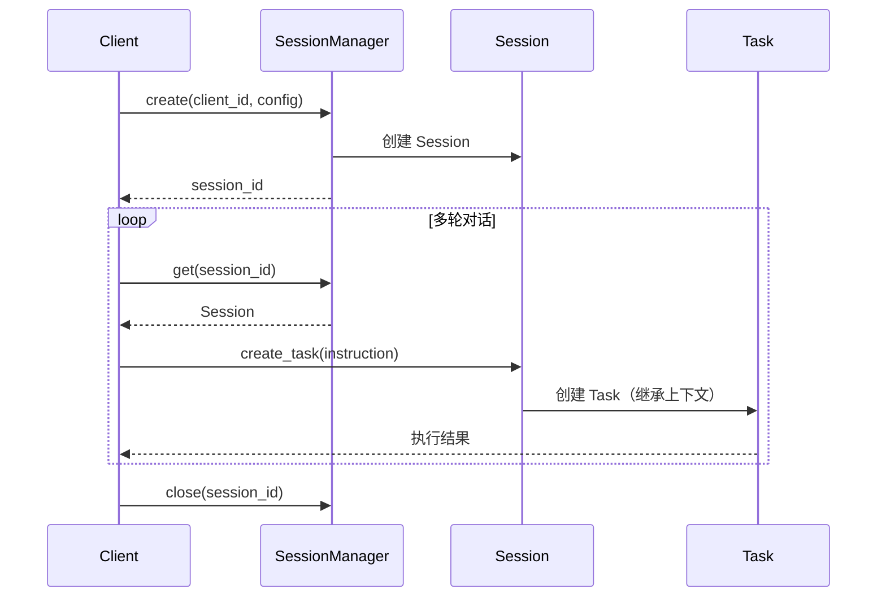

# 会话与任务

## 概述

会话与任务是 Omni-Agent 的核心领域模型，定义了 AI 交互的生命周期管理。

- **Task**：Agent 执行的原子单位，可独立存在
- **Session**：Task 的容器，用于多轮对话场景

## 核心实体

### Task（任务）

```python
@dataclass
class Task:
    task_id: str                    # 唯一标识
    instruction: str                # 用户指令（核心输入）
    input_modalities: List[ModalityType]  # 输入模态
    context: Optional[TaskContext]  # 上下文（来自 Session 或外部）
    status: TaskStatus              # 状态
    perception_buffer: List[PerceptionEvent]  # 感知缓冲区
    steps: List[ExecutionStep]      # 执行步骤
    result: Optional[TaskResult]    # 输出结果
```

**状态流转**：
```
PENDING → PERCEIVING → THINKING → ACTING → COMPLETED
                                        ↘ FAILED
```

### Session（会话）

```python
@dataclass
class Session:
    session_id: str
    client_id: str          # 调用方标识
    config: SessionConfig   # STT/LLM 配置
    tasks: List[Task]       # 任务历史
    status: SessionStatus   # 状态
    expires_at: datetime    # 过期时间
```

## 业务规则

| 规则 | 说明 |
|-----|-----|
| Task 独立性 | Task 不依赖 Session，可单独执行 |
| 单向依赖 | Session → Task，Task 不持有 Session 引用 |
| 上下文聚合 | Session 从历史 Task 聚合上下文传给新 Task |
| 自动过期 | Session 默认 1 小时超时，由 SessionManager 清理 |
| 最大限制 | 单实例最多 1000 个活跃 Session |

## 关键流程

### 多轮对话流程



### 单次任务流程（无 Session）

```python
from src.orchestrator import execute_task

async for result in execute_task(
    instruction="翻译这段话",
    input_modalities=[ModalityType.TEXT],
):
    print(result)
```
