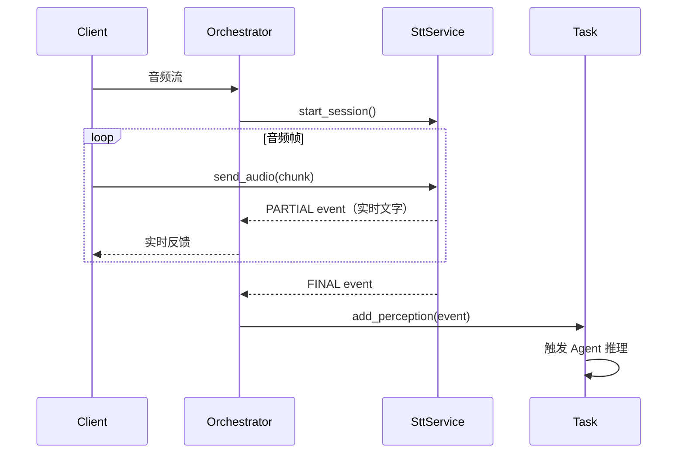

# 多模态感知

## 概述

多模态感知层负责将各种输入（语音、图像、文本等）转换为统一的 `PerceptionEvent`，供编排引擎消费。

## 核心实体

### ModalityType（模态类型）

```python
class ModalityType(Enum):
    TEXT = "text"      # 文本
    AUDIO = "audio"    # 音频
    VISION = "vision"  # 视觉
    DATA = "data"      # 结构化数据
```

### EventStage（事件阶段）

```python
class EventStage(Enum):
    PARTIAL = "partial"  # 增量/中间结果（如 STT 实时识别）
    FINAL = "final"      # 最终结果
```

### PerceptionEvent（感知事件）

所有感知管道的统一输出格式：

```python
@dataclass
class PerceptionEvent:
    event_id: str           # 事件 ID
    session_id: str         # 所属会话
    modality: ModalityType  # 模态类型
    source: str             # 来源，如 "stt_aliyun"
    stage: EventStage       # 阶段
    timestamp_ms: int       # 时间戳
    content: str            # 内容（文本化）
    confidence: float       # 置信度 [0, 1]
    metadata: Dict          # 扩展元数据
```

## 业务规则

| 规则 | 说明 |
|-----|-----|
| 统一输出 | 所有模态最终输出 PerceptionEvent |
| 实时流式 | 支持 PARTIAL 事件用于实时反馈 |
| 仅 FINAL 入缓冲 | 只有 FINAL 事件进入 Task 的 perception_buffer |
| 无业务逻辑 | 感知层只做转换，不做业务判断 |

## 关键流程

### 音频感知流程



### 创建感知事件

```python
from src.perception.base import PerceptionEvent, ModalityType, EventStage

event = PerceptionEvent.create(
    session_id="sess_xxx",
    modality=ModalityType.AUDIO,
    source="stt_aliyun",
    stage=EventStage.FINAL,
    content="用户说的话",
    confidence=0.95,
)
```
